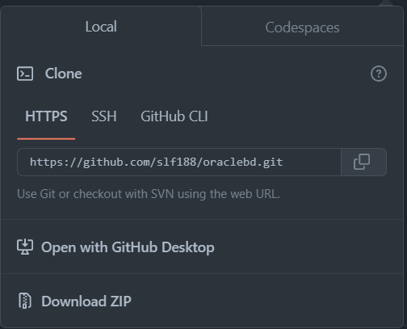

# oracledb

## Descripción

Base de datos hecha en Oracle, donde se aplican los conceptos de normalización y se crean las tablas necesarias para el funcionamiento de una base de datos.

## Objetivo

* Crear una base de datos en Oracle.
* Normalizar la base de datos.
* Interactuar con la maquina virtual de Oracle.
* Manejar la base de datos desde el cliente.

## Herramientas utilizadas

* [VSCode](https://code.visualstudio.com/)
* [Oracle VM VirtualBox](https://www.virtualbox.org/)
* [Mobaxterm](https://mobaxterm.mobatek.net/)
* [Sql Developer](https://www.oracle.com/tools/downloads/sqldev-downloads.html)
* [Oracle Database 11g Express Edition](https://www.oracle.com/database/technologies/xe-prior-releases.html)
* [Vim](https://www.vim.org/)
* [Git](https://git-scm.com/)
* [GitHub](https://github.com)

## Lenguajes utilizados

* [SQL](https://www.w3schools.com/sql/)
* [Markdown](https://www.markdownguide.org/)
* [Shell](https://www.shellscript.sh/)

## Instalación

Para instalar el repositorio se necesita el software Git.

En el terminal de la computadora escribir los siguientes comandos:

```bash
ls
cd [ubicación deseada en la computadora para ubicar la carpeta]
git init
git clone [el codigo HTTPS del repositorio]
```

En caso de que no se disponga de Git en la computadora, se puede instalar el repositorio en forma de ZIP, presionando en donde dice "Download ZIP".



## Referencias

* [ChatGPT](https://ai.com)
* [Stack Overflow](https://stackoverflow.com/)

## Licencia

[MIT](LICENSE)

## Autor

[Felipe Vallejo](https://www.linkedin.com/in/felipe-vallejo-200188/)